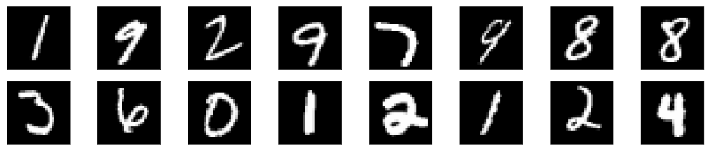
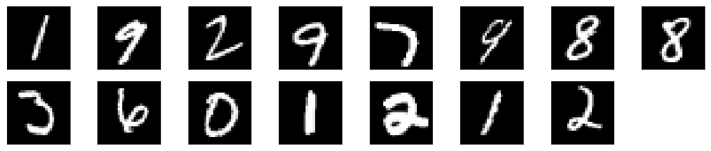

# Using Convolutional Autoencoder for clustering
The goal of this notebook is to test whether it is possible to use encoder part of autoencoder for clustering. The idea is to train an autoencoder, where the final layer of encoder (and first layer of decoder), is a n-dimensional vector, where n corresponds to number of clusters. The encoder could then be used for predicting to which cluster the input image belongs to.

The MNIST dataset is used in this case. The code is based on the following tutorial: https://blog.keras.io/building-autoencoders-in-keras.html. The encoder was changed by flattening the (4, 4, 8) tensor (or layer) to a 128-dimensional layer and then adding fully connected layer with 10 neurons (one for each MNIST number). 


```python
import numpy as np
np.random.seed(42)

from keras.layers import Input, Dense, Conv2D, MaxPooling2D, UpSampling2D, Flatten, Reshape
from keras.models import Model
from keras import backend as K

input_img = Input(shape=(28, 28, 1))  # adapt this if using `channels_first` image data format

x = Conv2D(16, (3, 3), activation='relu', padding='same')(input_img)
x = MaxPooling2D((2, 2), padding='same')(x)
x = Conv2D(8, (3, 3), activation='relu', padding='same')(x)
x = MaxPooling2D((2, 2), padding='same')(x)
x = Conv2D(8, (3, 3), activation='relu', padding='same')(x)

x = MaxPooling2D((2, 2), padding='same')(x)
print(K.int_shape(x))
x = Flatten()(x)
print(K.int_shape(x))
encoded = Dense(10, activation='relu')(x)


x = Dense(128, activation='relu')(encoded)
x = Reshape((4, 4, 8))(x)
x = Conv2D(8, (3, 3), activation='relu', padding='same')(x)
x = UpSampling2D((2, 2))(x)
x = Conv2D(8, (3, 3), activation='relu', padding='same')(x)
x = UpSampling2D((2, 2))(x)
x = Conv2D(16, (3, 3), activation='relu')(x)
x = UpSampling2D((2, 2))(x)
decoded = Conv2D(1, (3, 3), activation='sigmoid', padding='same')(x)

encoder = Model(input_img, encoded)
autoencoder = Model(input_img, decoded)
autoencoder.compile(optimizer='adadelta', loss='binary_crossentropy')
```
    (None, 4, 4, 8)
    (None, 128)


```python
from keras.datasets import mnist
import numpy as np

(x_train, _), (x_test, _) = mnist.load_data()

x_train = x_train.astype('float32') / 255.
x_test = x_test.astype('float32') / 255.
x_train = np.reshape(x_train, (len(x_train), 28, 28, 1))  # adapt this if using `channels_first` image data format
x_test = np.reshape(x_test, (len(x_test), 28, 28, 1))  # adapt this if using `channels_first` image data format
```

```python
from keras.callbacks import TensorBoard

autoencoder.fit(x_train, x_train,
                epochs=2,
                batch_size=128,
                shuffle=True,
                verbose=0,
                validation_data=(x_test, x_test))
```


    <keras.callbacks.History at 0x7f610549f240>


### Find class indexes

We predict the activity of neurons in the last encoder layer for each training sample and for each sample find which neuron was the most active. We then find images which were clustered into the first cluster (predicted_classes==1). 


```python
predicted_classes = np.argmax(encoder.predict(x_train), axis=1)
class_indexes = [idx[0] for idx in np.argwhere(predicted_classes==1)]
```
### Visualize images from one predicted cluster
Ten first images frome one cluster are then visualized. Ideally, being in one cluster, the following images should all be the same numbers.


```python
import matplotlib.pyplot as plt
n = 10
plt.figure(figsize=(20, 4))
j = 1
for i in class_indexes[:10]:
    # display original
    ax = plt.subplot(2, n, j)
    plt.imshow(x_test[i].reshape(28, 28))
    plt.gray()
    ax.get_xaxis().set_visible(False)
    ax.get_yaxis().set_visible(False)
    j += 1

    # display reconstruction
#     ax = plt.subplot(2, n, j + n)
#     plt.imshow(decoded_imgs[i].reshape(28, 28))
#     plt.gray()
#     ax.get_xaxis().set_visible(False)
#     ax.get_yaxis().set_visible(False)
plt.show()
```


## Conclusion
It seems that convolutional autoencoders by themselves are not very good at clustering images. It might be possible to use the encoder predictions as features for classical clustering algorithms, such as K-means.

# Autoencoder + k-means


```python
from sklearn.cluster import KMeans
import numpy as np
X = encoder.predict(x_train)
kmeans = KMeans(n_clusters=8, random_state=0).fit(X)
kmeans.labels_

#kmeans.predict([[0, 0], [4, 4]])

#kmeans.cluster_centers_

```


    array([0, 6, 2, ..., 7, 5, 1], dtype=int32)


```python
class_indexes = [idx[0] for idx in np.argwhere(kmeans.labels_==2)]

n = 8
plt.figure(figsize=(20, 4))
j = 1
for i in class_indexes[:15]:
    # display original
    ax = plt.subplot(2, n, j)
    plt.imshow(x_test[i].reshape(28, 28))
    plt.gray()
    ax.get_xaxis().set_visible(False)
    ax.get_yaxis().set_visible(False)
    j += 1

    # display reconstruction
#     ax = plt.subplot(2, n, j + n)
#     plt.imshow(decoded_imgs[i].reshape(28, 28))
#     plt.gray()
#     ax.get_xaxis().set_visible(False)
#     ax.get_yaxis().set_visible(False)
plt.show()
```






